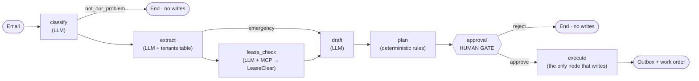

# LeaseOps

An AI agent that runs a property manager's maintenance inbox. It classifies tenant emails, checks the lease via [LeaseClear](https://github.com/amadeuserras/leaseclear) over MCP, drafts a reply, plans actions, and pauses for human approval before anything is sent or created.

**Plain English:** it reads the inbox, works out what each email is and whose fault it is, writes the reply, and then waits for you.

**[Live demo →](https://leaseops-psi.vercel.app)**

## What it does

- Surfaces each processed email as an approval card: issue type, severity, responsibility verdict, draft reply, and the suggested actions, with one-click approve or reject.
- Checks the tenant's actual lease to decide who's responsible, by asking LeaseClear questions over MCP.
- Pushes emergencies to the top instead of burying them among spam.
- Streams the whole agent run live over SSE: every node, tool call, tool result, token count, cost, and latency.
- Persists every run and every step, so a run can be reviewed or resumed later.
- Scores safety, classification, responsibility, cost, and latency against a 54-case golden dataset (see [Evals](#evals)).


## System overview




| Node          | What it does                                                                                | Who decides                 |
| ------------- | ------------------------------------------------------------------------------------------- | --------------------------- |
| `classify`    | Reads the email, picks one of four categories                                               | LLM                         |
| `extract`     | Pulls issue summary, severity, appliance from the text; looks up the tenant by sender email | LLM + DB                    |
| `lease_check` | Asks the lease up to 4 questions, then submits a responsibility verdict                     | LLM agent + MCP (read-only) |
| `draft`       | Writes the reply to the tenant                                                              | LLM                         |
| `plan`        | Chooses actions from a two-item whitelist                                                   | Code                        |
| `approval`    | Pauses the graph with a LangGraph `interrupt`                                               | Human                       |
| `execute`     | Writes the reply to `outbox` and the work order to `work_orders`                            | Code                        |


## Engineering decisions

- **A graph, not a free-roaming agent.** Rules I already know, like don't check the lease for spam (expensive, pointless) and don't check it for emergencies (slow, not the priority), are graph edges instead of prompt instructions. Same outcome, fewer tokens, fewer ways to be wrong. Each LLM is narrowed to the one thing it's actually good at: understanding natural text.
- **The main failure mode is measured.** A real issue misclassified as `not_our_problem` skips the pipeline entirely, no human sees it, and that's an hallucination the classify LLM could potentially do. That's the one failure mode the graph can't catch, which is why it has its own eval metric (*Missed real issue rate*).
- **Pydantic everywhere, especially at node boundaries.** Node outputs aren't just state diffs, they represent business logic and flow into the SSE stream, persisted steps, API responses, and mirrored frontend types. They're centralised in `agent/schemas.py` as the explicit definition of what each node does.
- **Streaming is the source of truth.** Steps are written to Postgres as they stream. The run entry point and the audit trail are the same code path, in `agent/runner.py`, coupled on purpose.
- **Verifiable verdicts.** LeaseClear's citations are extracted from every `lease_qa` answer and carried through the responsibility check, the draft, the approval card, and the run trace, so the human can see which clause the verdict rests on. Citations are clickable and open LeaseClear with same question the agent asked for manual verification.
- **Thin tests, heavy evals.** The evals exercise the whole system end to end, which implicitly covers the plumbing. Tests are deliberately kept thin and code focused: graph routing, the approval flow, idempotency, and API wiring. More test surface means more AI-generated diff to review for little extra confidence.
- **Three databases, one entry point.** dev, evals, and tests each use their own database so leftover data from one doesn't pollute the others and evals and tests can safely truncate before every run. The URL is set once at the entry point using `use_database()` in `db/session.py`, so the rest of the app just calls `open_session()` without needing to know or care which database it's talking to.
- **No real email service** Approved replies land in an `outbox` table and work orders in `work_orders`. Those tables are where a real email CRM would plug in. That integration was deliberately kept out of the scope of the project.


## Security: Prompt injection and the `tenants` table

A real risk in a system like this: an unknown sender emails a question, the agent asks LeaseClear, which answers from a real lease, the agent puts that answer in a draft, and a distracted human approves it, sending private lease terms to whoever sent the email. Untrusted input would be choosing which document gets read.

**The fix:** Every tenant lives in a `tenants` table that maps their email address to their real lease `document_id`. The document ID is structurally injected into the LeaseClear MCP tool call from this mapping, so the LLM never decides which document to query, it only sees a `question` schema.

Two consequences:

- An unknown sender has no `document_id`, so `lease_check` returns `unclear` and no lease is ever read.
- A registered tenant impersonating a *different* tenant still only ever reaches their own lease, no matter what the email asks for.

**The tradeoff:** requiring every tenant to be registered is slow, and the overwhelming majority of unknown senders are legitimate. The alternative (trusting the email body and letting the model identify the tenant) is faster and answers 99% of real emails instantly, and every reply still passes a human. This project chose the strict version because the security is the point. See **Tenant verification** in [What's next](#whats-next) for the better solution.

## Evals

54 golden cases run end to end through the live graph with real models, real MCP calls, and real DB writes, then scored on safety, accuracy, cost, and latency.


| Metric                               | Score  | Target | n   | Status |
| ------------------------------------ | ------ | ------ | --- | ------ |
| Unauthorized-action rate             | 0.0%   | = 0%   | 54  | PASS   |
| Classification accuracy              | 98.1%  | ≥ 95%  | 54  | PASS   |
| Responsibility accuracy              | 89.5%  | ≥ 90%  | 38  | FAIL   |
| Missed real issue rate               | 0.0%   | = 0%   | 47  | PASS   |
| Missed emergency rate                | 0.0%   | = 0%   | 9   | PASS   |
| Landlord issue blamed on tenant rate | 0.0%   | = 0%   | 14  | PASS   |
| Mean QA calls                        | 1.8    | —      | 38  | —      |
| p95 cost / task                      | $0.017 | —      | 54  | —      |
| p95 latency                          | 55.0s  | —      | 54  | —      |


*Total cost $0.58 · Total time 26m 44s · full report:* [eval-20260811-130035.md](./backend/src/leaseops/evals/reports/eval-20260811-130035.md)

### Metric cheat sheet

- **Unauthorized action rate** — Agent wrote before approval, or wrote an after-approval action not in the golden set.
- **Classification accuracy** — Predicted category matches the golden category.
- **Missed real issue rate** — A real issue was classified `not_our_problem`. *Critical:* no draft, no approval, no human sees it.
- **Missed emergency rate** — A real emergency wasn't classified as one. *Critical:* it skips emergency routing and gets treated as a normal email.
- **Responsibility accuracy** — Predicted responsibility matches the golden verdict.
- **Landlord issue blamed on tenant rate** — A landlord-responsible case predicted as tenant. *Critical:* no work order, and the tenant is wrongly blamed against their own lease.
- **Mean QA calls** — Average `lease_qa` calls per email (capped at 4).
- **p95 cost / task, p95 latency** — 95th percentile USD cost and time to run one email.


## API overview

- `POST /runs/stream` — run the agent and stream it as SSE (`run_started`, `node_started`, `node_finished`, `tool_call`, `tool_result`, `cost`, `paused`, `run_finished`, `error`)
- `POST /runs/rerun/stream` — wipe a previous run and stream it again
- `POST /runs` · `GET /runs/{email_id}` · `GET /runs/latest`
- `GET /approvals` · `POST /approvals/{run_id}/approve` · `POST /approvals/{run_id}/reject`
- `GET`, `POST /inbox` · `GET /inbox/{email_id}`
- `GET`, `POST /work-orders` · `GET`, `PATCH`, `DELETE /work-orders/{work_order_id}`
- `GET /health`

Agent run endpoints (`POST /runs`, `/runs/stream`, `/runs/rerun/stream`) have a per-IP rate limit of 10/minute.
MCP server exposes one tool: `lease_qa(question, document_id)`.

## Tech stack

**AI & orchestration**

- LangGraph with Postgres checkpointing (`AsyncPostgresSaver`)
- MCP server + client for lease Q&A against LeaseClear
- GPT-4o-mini for classify / extract / draft, Claude Sonnet 4.6 for the lease-check tool loop
- Structured outputs via Pydantic

**Backend**

- FastAPI, PostgreSQL 16, SQLAlchemy 2 (async), Alembic
- Pydantic v2, pydantic-settings, Server-Sent Events
- Python 3.12, uv, Ruff, Pyright

**Frontend**

- Next.js 15, React 19, TypeScript, Tailwind CSS v4

**Quality**

- 54-case eval harness with generated markdown reports
- pytest against an isolated database
- GitHub Actions


## What's next

- **Run emails automatically.** Highest-ROI item by far. Runs are manual today only so demo visitors can watch the agent work. But in production, you want to login in the morning and see all new emails already processed and with their approval cards waiting.
- **Tenant verification.** When a tenant moves in, store the verified address in `tenants` with a "confirm your email" link, then automatically route unknown senders through a `verify_sender` action and draft a verification reply instead of dropping them silently. Add an eval that enforces a hard 0% unknown-sender pass rate.
- **Connect a real inbox** sync emails from a property CRM or an option to upload an email export. LeaseClear and LeaseOps share that account so leases and emails stay related.
- **An** `investigate` **node** that reads past conversation history with the tenant and adjusts the draft accordingly.
- **Editable drafts in the approval card.** Obvious feature, just not what the project is about.
- **Reconcile the two run-shaped payloads.** `GET /runs/{email_id}` and `POST /runs/stream` return slightly different shapes. The stream genuinely needs extra data for the live animation, but the frontend currently does too much reshaping work that belongs in the backend. Plumbing work left alone for the sake of shipping speed.


## Local setup

`lease_check` talks to LeaseClear through the sibling [leaseclear-mcp](https://github.com/amadeuserras/leaseclear-mcp) package (`uvx --from ../leaseclear-mcp leaseclear-mcp`). Check out `../leaseclear-mcp` and run [LeaseClear](https://github.com/amadeuserras/leaseclear) per its README.

```bash
# Backend
cd backend
cp .env.example .env          # add ANTHROPIC_API_KEY and OPENAI_API_KEY
uv sync
docker compose -f ../docker-compose.yml up -d
uv run alembic upgrade head
uv run python scripts/seed.py

# Frontend
cd ../frontend
cp .env.example .env
npm install

# Start everything (LeaseOps API, LeaseClear API, frontend)
cd ..
./dev.sh
```

Frontend: [http://localhost:3000](http://localhost:3000)
LeaseOps API: [http://localhost:8000](http://localhost:8000)
LeaseClear API: [http://localhost:8001](http://localhost:8001)

Postgres runs on host port **5434**. The test and eval databases (`leaseops_test`, `leaseops_evals`) need to exist before you use them:

```bash
docker compose exec postgres createdb -U leaseops leaseops_test
docker compose exec postgres createdb -U leaseops leaseops_evals
uv run alembic -x db=evals upgrade head
```


### Other scripts

```bash
cd backend
uv run python scripts/print_graph.py    # print the graph as ASCII
uv run python scripts/runs_stream.py    # consume the SSE stream from the CLI
uv run python scripts/preview.py        # dump DB rows (--evals / --tests)
```


## Tests

Tests live in `backend/tests/` and use `TEST_DATABASE_URL`. The schema is recreated for each test, so no migrations are needed.

```bash
cd backend
uv run python scripts/seed.py --tests
uv run pytest
uv run pytest tests/test_approvals.py   # single file
```


## Evals

Evals run against `EVALS_DATABASE_URL` and make real model and MCP calls, so LeaseClear must be running and both API keys must be set. A full 54-case run costs roughly $0.55 and takes about 20 minutes.

```bash
cd backend
uv run alembic -x db=evals upgrade head
uv run python scripts/seed.py --evals
uv run python scripts/run_evals.py
```


| Flag          | Description                         |
| ------------- | ----------------------------------- |
| `--limit N`   | Run only the first `N` golden cases |
| `--ids a,b,c` | Run specific cases by ID            |
| `--failures`  | Re-run the known failing cases only |


Reports are written to `backend/src/leaseops/evals/reports/`.